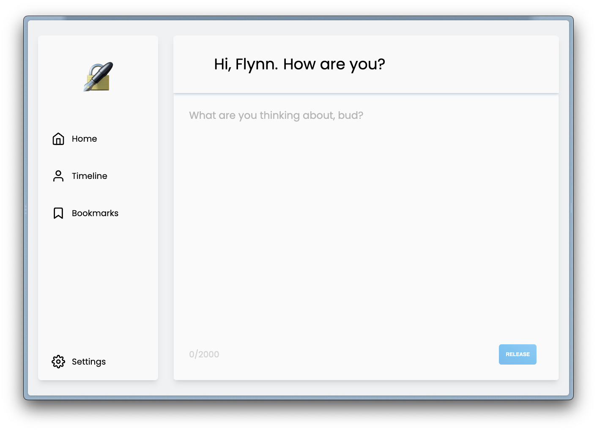

  <h1 align="center">
    🔏 Scrawl
  </h1>

  <h2 align="center">
  Scrawl is a safe and private space for you to store your thoughts. No ads, data collection, likes or retweets. Just you and what you're thinking.
  </h2>

## Tech Stack

- Next.js
- Typescript
- TRPC
- Tailwind
- Prisma
- NextAuth

Through building this app, I've come to really appreciate type completion with Typescript. Beforehand, I thought it was just for lazy developers who could not be bothered to type `{user.info.name}` or whatever. Now, I realise how useful types are in developing your app faster and making development easier through types/interfaces you have set up to reduce complexity. Typescript has helped me retain some of my sanity, so that's got to count for something.

❤️ TRPC ❤️

## Planned Features

These are features that I think that would put the cherry on top of the project, but I haven't had time to implement them.

- Search thoughts by day/week/month/etc.
- See a list of thoughts under the one you have clicked on from that same day.
- Replace most buttons with text with a proper icons.
- Ability to save thoughts as a draft to come back to later.
- Ability to give thoughts an (option) tite/header.
- Ability to create thoughts with Markdown.
